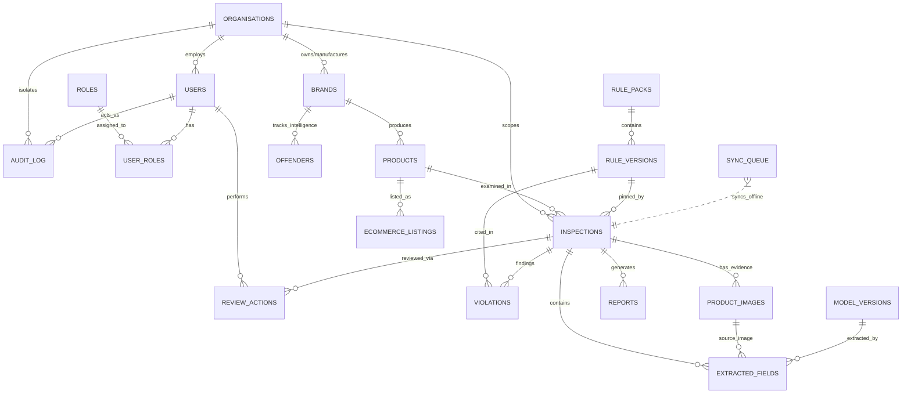

# LabelSetu Database Architecture & Engineering Guide
**SIH Problem Statement 26034: AI-assisted Legal Metrology Compliance Intelligence**
**Department of Consumer Affairs (DoCA) — Ministry of Consumer Affairs, Food & Public Distribution**

---

## 1. Executive Summary

LabelSetu turns physical package photos and digital e-commerce listings into explainable, legally reviewable, and auditable Legal Metrology inspections under the **Legal Metrology (Packaged Commodities) Rules, 2011 (LMPC)**.

The database architecture is designed with **19 normalized relational entities** backed by **PostgreSQL 16**, **PostGIS**, **SQLAlchemy 2.0**, **Alembic**, **pg_trgm**, **tsvector Full-Text Search**, and **MinIO S3-compatible Object Storage**.



---

## 2. Core Architectural Principles

1. **Typed State Columns:** Queryable attributes (status, channel, rule IDs, dates, scores, severity) use typed native SQL columns.
2. **Targeted JSONB:** JSONB is restricted to evolving nested structures (OCR bounding boxes, polygon vertices, calibration transforms, raw marketplace payloads, rule logic trees).
3. **Immutable Raw OCR:** Raw unedited OCR extraction in `extracted_fields.raw_text` is **never overwritten** when an officer makes a correction; corrections are appended to `review_actions` to feed curated active-learning datasets.
4. **Pinned Rule Versions:** Every inspection explicitly pins exactly one immutable `rule_versions.id` release.
5. **Cryptographic SHA-256 Hashes:** Every evidence image original and statutory report artifact is fingerprinted with a SHA-256 digest at ingestion.
6. **Derived Crop Lineage:** Bounding box crops retain parent image ID, coordinate matrices, transform version, and crop hash.
7. **Append-Only Tamper-Evident Audit Chaining:** The `audit_log` is cryptographically chained using `prev_hash` and `event_hash`:
   $$\text{canonical\_event} = \text{timestamp} \mid \text{actor} \mid \text{action} \mid \text{entity\_type} \mid \text{entity\_id} \mid \text{canonical(before)} \mid \text{canonical(after)} \mid \text{prev\_hash}$$
   $$\text{event\_hash} = \text{SHA-256}(\text{canonical\_event})$$
8. **Multi-Tenant Organisation Isolation:** Scopes users, inspections, brands, and audit logs by authority (DoCA, State Enforcement, Manufacturer, Platform).
9. **PostGIS Geography:** Uses `geography(Point, 4326)` for inspection locations and spatial indexing.
10. **Full-Text & Trigram Search:** Uses PostgreSQL `tsvector` multi-column search and `pg_trgm` GIN indexes on `brands.canonical_name` for OCR-tolerant fuzzy lookups.
11. **Idempotent Sync Queue:** Offline field app captures sync through `sync_queue` with deterministic `idempotency_key` (Device ID + Local UUID) to prevent duplicate inspections on network retries.
12. **Object Storage Offloading:** Raw high-resolution image binaries, crop thumbnails, statutory PDF reports, and HTML snapshots are stored in MinIO S3 buckets (`labelsetu-evidence`, `labelsetu-reports`, `labelsetu-snapshots`), storing only object keys and hashes in PostgreSQL.

---

## 3. Table Catalog & Schema Specification

### 1. `organisations`
* **Purpose:** Multi-tenant isolation for Central DoCA, State Metrology Departments, Manufacturers, Platforms, and Demo environments.
* **Columns:**
  * `id` (UUID, PK)
  * `name` (VARCHAR(255), Index)
  * `type` (VARCHAR(50), Index: `DoCA`, `state`, `manufacturer`, `platform`, `demo`)
  * `state_code` (VARCHAR(10), Nullable: e.g. `'DL'`, `'MH'`, `'KA'`, `'WB'`)
  * `status` (VARCHAR(50): `active`, `inactive`, `suspended`)
  * `created_at`, `updated_at` (TIMESTAMPTZ)

### 2. `roles`
* **Purpose:** RBAC system authority definitions.
* **Supported Roles:** `super_admin`, `rule_admin`, `officer`, `reviewer`, `manufacturer`, `consumer`, `analyst`.
* **Columns:**
  * `id` (UUID, PK)
  * `code` (VARCHAR(50), Unique Index)
  * `description` (VARCHAR(255))
  * `permissions_jsonb` (JSONB: Granular permission flags)
  * `created_at`, `updated_at` (TIMESTAMPTZ)

### 3. `users`
* **Purpose:** User identity and authentication credentials.
* **Columns:**
  * `id` (UUID, PK)
  * `organisation_id` (UUID, FK -> `organisations.id`, Index)
  * `email` (VARCHAR(255), Unique Index)
  * `phone` (VARCHAR(50), Nullable)
  * `password_hash` (VARCHAR(255))
  * `full_name` (VARCHAR(255))
  * `status` (VARCHAR(50): `active`, `inactive`, `pending`, `suspended`)
  * `last_login_at` (TIMESTAMPTZ, Nullable)
  * `created_at`, `updated_at` (TIMESTAMPTZ)

### 4. `user_roles`
* **Purpose:** Scoped user-to-role assignment within specific organisation contexts (allows an officer to also act as reviewer without role sprawl).
* **Columns:**
  * `id` (UUID, PK)
  * `user_id` (UUID, FK -> `users.id`)
  * `role_id` (UUID, FK -> `roles.id`)
  * `organisation_id` (UUID, FK -> `organisations.id`)
  * `created_at` (TIMESTAMPTZ)
  * *Constraint:* `UNIQUE(user_id, role_id, organisation_id)`

### 5. `brands`
* **Purpose:** Canonical brand catalog serving as normalization target for repeat-offender intelligence.
* **Columns:**
  * `id` (UUID, PK)
  * `canonical_name` (VARCHAR(255), Trigram GIN Indexed)
  * `aliases_jsonb` (JSONB: List of OCR variants, misspellings, transliterations)
  * `manufacturer_org_id` (UUID, FK -> `organisations.id`, Nullable)
  * `created_at`, `updated_at` (TIMESTAMPTZ)

### 6. `products`
* **Purpose:** Packaged commodity catalogue subject to LMPC Rules.
* **Columns:**
  * `id` (UUID, PK)
  * `brand_id` (UUID, FK -> `brands.id`, Index)
  * `generic_name` (VARCHAR(255), Index: Rule 6(1)(b) commodity name)
  * `sku` (VARCHAR(100), Nullable, Index)
  * `category` (VARCHAR(100), Index: `food_staples`, `edible_oil`, `cosmetics`, `cleaning_products`, `textiles`, `electronics`)
  * `is_imported` (BOOLEAN: Triggers Rule 6(1) country-of-origin check)
  * `metadata_jsonb` (JSONB: Standard quantities, dimensions, HSN)
  * `created_at`, `updated_at` (TIMESTAMPTZ)

### 7. `rule_packs`
* **Purpose:** Logical container for statutory rule sets (e.g. `lmpc-core`).
* **Columns:**
  * `id` (VARCHAR(100), PK: e.g. `'lmpc-core'`)
  * `name` (VARCHAR(255))
  * `jurisdiction` (VARCHAR(100): Default `'India'`)
  * `owner_org_id` (UUID, FK -> `organisations.id`, Nullable)
  * `created_at`, `updated_at` (TIMESTAMPTZ)

### 8. `rule_versions`
* **Purpose:** Immutable released rule configuration containing declarative JSON validation logic.
* **Columns:**
  * `id` (UUID, PK)
  * `rule_pack_id` (VARCHAR(100), FK -> `rule_packs.id`, Index)
  * `version` (VARCHAR(50), Index: e.g. `'2026.0'`)
  * `effective_from` (TIMESTAMPTZ)
  * `content_jsonb` (JSONB: Declarative rule clauses, regex patterns, logic expressions, calibration tables, severity weights)
  * `sha256` (VARCHAR(64): Integrity checksum of content_jsonb)
  * `approved_by` (UUID, FK -> `users.id`, Nullable)
  * `approved_at` (TIMESTAMPTZ, Nullable)
  * `status` (VARCHAR(50): `draft`, `staged`, `active`, `deprecated`, `immutable`)
  * `created_at`, `updated_at` (TIMESTAMPTZ)
  * *Constraint:* `UNIQUE(rule_pack_id, version)`

### 9. `model_versions`
* **Purpose:** CV and OCR model evaluation registry.
* **Columns:**
  * `id` (UUID, PK)
  * `name` (VARCHAR(100), Index: `PaddleOCR-PP-OCRv5-Multilingual`, `YOLOv8-PDP-Seg`)
  * `version` (VARCHAR(50))
  * `artifact_uri` (VARCHAR(500))
  * `metrics_jsonb` (JSONB: Precision, recall, IoU, font MAE)
  * `approved_at` (TIMESTAMPTZ, Nullable)
  * `created_at`, `updated_at` (TIMESTAMPTZ)
  * *Constraint:* `UNIQUE(name, version)`

### 10. `inspections`
* **Purpose:** Core case entity tracking physical package, e-commerce, or consumer compliance audits.
* **Columns:**
  * `id` (UUID, PK)
  * `organisation_id` (UUID, FK -> `organisations.id`, Index)
  * `product_id` (UUID, FK -> `products.id`, Nullable, Index)
  * `channel` (VARCHAR(50), Index: `package`, `ecommerce`, `consumer`)
  * `status` (VARCHAR(50), Index: `draft`, `queued`, `processing`, `review_required`, `completed`, `needs_recapture`, `archived`)
  * `rule_version_id` (UUID, FK -> `rule_versions.id`, Index: Pinned exact rule version)
  * `score` (FLOAT, Nullable: Computed compliance score 0-100)
  * `score_status` (VARCHAR(50): `'provisional'` or `'verified'`)
  * `location` (PostGIS `geography(Point, 4326)`, Spatial GiST Index)
  * `latitude`, `longitude` (FLOAT, Nullable)
  * `district` (VARCHAR(100), Index)
  * `state_code` (VARCHAR(10), Index)
  * `officer_notes` (TEXT, Nullable)
  * `search_vector` (TSVECTOR, GIN Index)
  * `captured_at` (TIMESTAMPTZ, Index)
  * `created_by` (UUID, FK -> `users.id`, Nullable, Index)
  * `created_at`, `updated_at` (TIMESTAMPTZ)

### 11. `product_images`
* **Purpose:** Evidence image metadata and calibration parameters.
* **Columns:**
  * `id` (UUID, PK)
  * `inspection_id` (UUID, FK -> `inspections.id`, Index)
  * `object_key` (VARCHAR(500): MinIO S3 object path)
  * `sha256` (VARCHAR(64), Index: SHA-256 hash of original image bytes)
  * `captured_at` (TIMESTAMPTZ)
  * `location` (PostGIS `geography(Point, 4326)`, Nullable)
  * `gps_accuracy_m` (FLOAT, Nullable)
  * `quality_jsonb` (JSONB: Blur score, glare ratio, resolution check)
  * `transform_jsonb` (JSONB: Dewarp matrix, perspective coordinates)
  * `calibration_jsonb` (JSONB: Mode `aruco_50mm`, `px_per_mm` scale, confidence, error)
  * `status` (VARCHAR(50): `uploaded`, `processing`, `valid`, `needs_recapture`, `rejected`)
  * `created_at`, `updated_at` (TIMESTAMPTZ)

### 12. `extracted_fields`
* **Purpose:** Extracted label declarations preserving immutable raw OCR text.
* **Columns:**
  * `id` (UUID, PK)
  * `inspection_id` (UUID, FK -> `inspections.id`, Index)
  * `image_id` (UUID, FK -> `product_images.id`, Nullable, Index)
  * `field_type` (VARCHAR(100), Index: `mrp`, `net_quantity`, `mfg_date`, `consumer_care`, `address`, `origin`, `generic_name`, `dimensions`)
  * `raw_text` (TEXT: Raw unedited OCR output)
  * `normalized_jsonb` (JSONB: Parsed amounts, units, dates, currencies)
  * `bbox_jsonb` (JSONB: Normalized `[x, y, w, h]` box)
  * `polygon_jsonb` (JSONB: Contour polygon vertices)
  * `confidence` (FLOAT: 0.0 - 1.0)
  * `language` (VARCHAR(20): `eng`, `hin`, `tam`, `mar`)
  * `model_version` (VARCHAR(100), Nullable)
  * `model_version_id` (UUID, FK -> `model_versions.id`, Nullable)
  * `review_status` (VARCHAR(50), Index: `unreviewed`, `confirmed`, `corrected`, `dismissed`)
  * `created_at`, `updated_at` (TIMESTAMPTZ)

### 13. `violations`
* **Purpose:** Discrete rule contraventions citing exact LMPC clauses.
* **Columns:**
  * `id` (UUID, PK)
  * `inspection_id` (UUID, FK -> `inspections.id`, Index)
  * `rule_version_id` (UUID, FK -> `rule_versions.id`, Index)
  * `rule_id` (VARCHAR(100), Index: e.g. `LMPC-6-1-E-MRP-001`, `LMPC-7-NUMERAL-HEIGHT-006`)
  * `clause` (VARCHAR(100): e.g. `Rule 6(1)(e)`, `Rule 7(2)(i) Table I`)
  * `status` (VARCHAR(50), Index: `detected`, `confirmed`, `dismissed`, `waived`, `resolved`)
  * `severity` (VARCHAR(50), Index: `Critical`, `Major`, `Minor`, `Review required`)
  * `message` (TEXT)
  * `evidence_jsonb` (JSONB: Evidence crop key, SHA-256, snippet, formula trace)
  * `confidence` (FLOAT)
  * `officer_disposition` (VARCHAR(50), Nullable: `confirmed`, `dismissed`, `waived`)
  * `resolved_at` (TIMESTAMPTZ, Nullable)
  * `created_at`, `updated_at` (TIMESTAMPTZ)

### 14. `reports`
* **Purpose:** Generated statutory PDF, DOCX, and CSV reports with signing officer provenance.
* **Columns:**
  * `id` (UUID, PK)
  * `inspection_id` (UUID, FK -> `inspections.id`, Index)
  * `type` (VARCHAR(20), Index: `PDF`, `DOCX`, `CSV`)
  * `version` (VARCHAR(50): Default `'1.0'`)
  * `object_key` (VARCHAR(500): MinIO S3 object path)
  * `sha256` (VARCHAR(64), Index)
  * `generated_by` (UUID, FK -> `users.id`, Nullable)
  * `approved_by` (UUID, FK -> `users.id`, Nullable)
  * `generated_at` (TIMESTAMPTZ)
  * `created_at` (TIMESTAMPTZ)

### 15. `review_actions`
* **Purpose:** Officer review decisions and manual corrections, maintaining separation between AI extraction and human governance.
* **Columns:**
  * `id` (UUID, PK)
  * `inspection_id` (UUID, FK -> `inspections.id`, Index)
  * `field_id` (UUID, FK -> `extracted_fields.id`, Nullable, Index)
  * `violation_id` (UUID, FK -> `violations.id`, Nullable, Index)
  * `reviewer_id` (UUID, FK -> `users.id`, Index)
  * `action` (VARCHAR(50), Index: `accept`, `correct`, `dismiss`, `waive`, `request_recapture`)
  * `corrected_value_jsonb` (JSONB, Nullable: Officer-supplied correction payload)
  * `reason` (TEXT, Nullable)
  * `created_at` (TIMESTAMPTZ, Index)

### 16. `audit_log`
* **Purpose:** Cryptographically chained append-only operational audit trail.
* **Columns:**
  * `id` (UUID, PK)
  * `organisation_id` (UUID, FK -> `organisations.id`, Nullable, Index)
  * `actor_id` (UUID, FK -> `users.id`, Nullable, Index)
  * `entity_type` (VARCHAR(100), Index)
  * `entity_id` (VARCHAR(100), Index)
  * `action` (VARCHAR(100), Index: `CREATE`, `UPDATE`, `DELETE`, `REVIEW_ACCEPT`, `REVIEW_CORRECT`, `APPROVE_REPORT`)
  * `before_jsonb` (JSONB, Nullable)
  * `after_jsonb` (JSONB, Nullable)
  * `event_at` (TIMESTAMPTZ, Index)
  * `prev_hash` (VARCHAR(64), Nullable: SHA-256 hash of preceding audit record)
  * `event_hash` (VARCHAR(64), Unique Index: SHA-256 over canonical event)
  * `request_id` (VARCHAR(100), Nullable)

### 17. `offenders`
* **Purpose:** Recomputed enforcement intelligence tracking repeat brand non-compliance trends (Operational intelligence, NOT a public blacklist).
* **Columns:**
  * `id` (UUID, PK)
  * `brand_id` (UUID, FK -> `brands.id`, Index)
  * `period_start` (DATE, Index)
  * `period_end` (DATE, Index)
  * `inspection_count` (INT)
  * `confirmed_count` (INT)
  * `severity_score` (FLOAT)
  * `last_seen_at` (TIMESTAMPTZ)
  * `created_at`, `updated_at` (TIMESTAMPTZ)

### 18. `sync_queue`
* **Purpose:** Offline mobile outbox queue supporting idempotent field synchronization.
* **Columns:**
  * `id` (UUID, PK)
  * `device_id` (VARCHAR(100), Index)
  * `local_event_id` (VARCHAR(100))
  * `entity_type` (VARCHAR(100))
  * `payload_jsonb` (JSONB: Offline capture metadata, images, coordinates)
  * `status` (VARCHAR(50), Index: `pending`, `processing`, `synced`, `failed`, `conflict`)
  * `attempts` (INT: Default 0)
  * `idempotency_key` (VARCHAR(255), Unique Index: Deterministic client key)
  * `received_at` (TIMESTAMPTZ)
  * `processed_at` (TIMESTAMPTZ, Nullable)
  * `error_message` (TEXT, Nullable)
  * `created_at`, `updated_at` (TIMESTAMPTZ)

### 19. `ecommerce_listings`
* **Purpose:** Marketplace digital listing inspections under Rule 6(10) (e.g. Amazon, Flipkart, Blinkit, Zepto).
* **Columns:**
  * `id` (UUID, PK)
  * `platform` (VARCHAR(100), Index)
  * `external_listing_id` (VARCHAR(255), Index)
  * `url` (TEXT)
  * `product_id` (UUID, FK -> `products.id`, Nullable, Index)
  * `snapshot_key` (VARCHAR(500), Nullable: MinIO object key for rendered snapshot)
  * `content_hash` (VARCHAR(64), Nullable: SHA-256 of scraped payload)
  * `captured_at` (TIMESTAMPTZ)
  * `seller_name` (VARCHAR(255), Nullable, Index)
  * `availability` (VARCHAR(50), Nullable)
  * `raw_jsonb` (JSONB: Raw marketplace attributes)
  * `created_at`, `updated_at` (TIMESTAMPTZ)
  * *Constraint:* `UNIQUE(platform, external_listing_id)`

---

## 4. Declarative Rule Pack (`lmpc-core @ 2026.0`)

Legal rules are stored as declarative configuration inside `rule_versions.content_jsonb`:

| Rule ID | Clause | Description | Severity | Penalty Reference |
| :--- | :--- | :--- | :--- | :--- |
| `LMPC-6-1-A-ADDRESS-005` | Rule 6(1)(a) | Manufacturer/Packer/Importer name & postal address | **Critical** (-25) | LMA 2009, Sec 36(1) |
| `LMPC-6-1-C-NETQ-002` | Rule 6(1)(c) | Net quantity in standard units (g, kg, ml, l, m, cm, N) | **Critical** (-25) | LMA 2009, Sec 36(1) |
| `LMPC-6-1-D-DATE-003` | Rule 6(1)(d) | Month/Year of packing (exempt online per Rule 6(10)) | **Major** (-12) | LMA 2009, Sec 36(1) |
| `LMPC-6-1-E-MRP-001` | Rule 6(1)(e) | Retail price with currency symbol (₹/Rs./INR), 2 decimals | **Major** (-12) | LMA 2009, Sec 36(1) |
| `LMPC-6-2-CARE-004` | Rule 6(2) | Consumer care name, address, email, telephone | **Major** (-12) | LMA 2009, Sec 36(1) |
| `LMPC-7-NUMERAL-HEIGHT-006` | Rule 7 Table I | Net quantity font height in mm (requires scale $\ge 0.90$) | **Major** (-12) | LMA 2009, Sec 36(1) |
| `LMPC-7-QUIET-ZONE-007` | Rule 7 Clearance | 1× height top/bottom, 2× height left/right blank space | **Minor** (-4) | LMA 2009, Sec 36(1) |

### Rule 7 Table I (Weight/Volume Numeral Heights)
* $\le 200\,\text{g/ml} \implies 1.0\,\text{mm}$ (normal) / $2.0\,\text{mm}$ (formed)
* $> 200 - 500\,\text{g/ml} \implies 2.0\,\text{mm}$ (normal) / $4.0\,\text{mm}$ (formed)
* $> 500\,\text{g/ml} \implies 4.0\,\text{mm}$ (normal) / $6.0\,\text{mm}$ (formed)

---

## 5. Quickstart & Setup Commands

### 1. Launch Docker Infrastructure
```bash
docker compose up -d
```
Starts:
* PostgreSQL 16 + PostGIS 3.4 on `localhost:5432`
* MinIO Object Storage on `localhost:9000` (Console on `9001`) with automatic buckets:
  * `labelsetu-evidence`
  * `labelsetu-reports`
  * `labelsetu-snapshots`
* Redis 7 on `localhost:6379`

### 2. Apply Alembic Migrations
```bash
# Upgrade from blank database to latest schema
py -m alembic -c backend/alembic.ini upgrade head
```

### 3. Run Database Seed Script
```bash
py backend/app/seeds/seed_data.py
```

### 4. Run Integrity Verification Script
```bash
py scripts/verify_database.py
```

### 5. Run Automated Test Suite
```bash
py -m pytest tests/test_database.py -v
```

---

## 6. Key SQL Query Recipes

### 1. Full-Text Search Across Inspections & Evidence
```sql
SELECT i.id, i.channel, i.status, i.score, b.canonical_name AS brand, p.generic_name
FROM inspections i
JOIN products p ON i.product_id = p.id
JOIN brands b ON p.brand_id = b.id
WHERE i.search_vector @@ plainto_tsquery('english', 'atta 5kg fortune')
ORDER BY i.captured_at DESC;
```

### 2. Trigram OCR Fuzzy Brand Search (`pg_trgm`)
```sql
-- Handles noisy OCR spellings like 'Aashirvad', 'Fortun', 'Ashirwad'
SELECT id, canonical_name, similarity(canonical_name, 'Aashirvad') AS score
FROM brands
WHERE canonical_name % 'Aashirvad'
ORDER BY score DESC;
```

### 3. PostGIS Spatial District Heatmap Query
```sql
SELECT 
    district, 
    state_code, 
    COUNT(id) AS total_inspections,
    AVG(score) AS average_compliance_score,
    COUNT(CASE WHEN status = 'review_required' THEN 1 END) AS pending_violations
FROM inspections
WHERE location IS NOT NULL
GROUP BY district, state_code
ORDER BY total_inspections DESC;
```

### 4. Repeat Offender Intelligence Rollup
```sql
SELECT 
    b.canonical_name,
    o.period_start,
    o.period_end,
    o.inspection_count,
    o.confirmed_count,
    o.severity_score,
    ROUND((o.confirmed_count::numeric / NULLIF(o.inspection_count, 0) * 100), 1) AS non_compliance_rate_pct
FROM offenders o
JOIN brands b ON o.brand_id = b.id
ORDER BY o.severity_score DESC;
```
