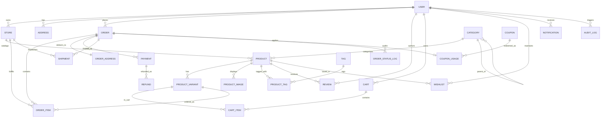

# Garuda Database Architecture & Schema Documentation

This document describes the database design, schema relations, indexing strategy, and operational workflows for the **Garuda E-Commerce & Multi-Vendor Marketplace Platform**.

---

## 1. Architectural Principles

1. **Multi-Vendor Isolation & Splitting**:
   - Products are scoped to specific vendors/sellers via `Store`.
   - Orders support multi-vendor basket items via `OrderItem.storeId` and dedicated `Shipment` records per vendor.
2. **Strict Financial Integrity**:
   - Monetary values (`basePrice`, `price`, `subtotal`, `taxAmount`, `shippingAmount`, `totalAmount`, etc.) use exact `Decimal(10, 2)` types rather than floating-point values to avoid rounding precision loss.
   - Address snapshots at purchase time (`OrderAddress`) prevent retroactive address edits from mutating historical invoices.
3. **Optimized Query Indexing**:
   - B-tree indexes are placed on search terms, slug lookups, foreign keys, filtering flags (`status`, `isFeatured`), and date ranges for reporting.
4. **Hierarchical Categorization**:
   - `Category` uses self-referencing relationships (`parentId` / `children`) to support arbitrary nesting depths (e.g. `Electronics` -> `Audio` -> `Wireless Headphones`).
5. **Auditing & Event Tracking**:
   - `AuditLog` captures entity mutations and user changes with JSONB payload deltas.
   - `OrderStatusLog` provides an immutable event log for every state transition in order lifecycles.

---

## 2. Entity Relationship Diagram (ERD)



---

## 3. Schema Modules & Models Summary

| Module | Model | Primary Role | Key Relations & Constraints |
| :--- | :--- | :--- | :--- |
| **IAM** | `User` | Authentication, identities, and roles | Roles: `CUSTOMER`, `SELLER`, `ADMIN`, `SUPER_ADMIN`. Unique email index. |
| **IAM** | `UserProfile` | Extended user meta, seller tax info | 1-to-1 with `User`, cascade delete on user deletion. |
| **IAM** | `Address` | Shipping and billing addresses | Types: `SHIPPING`, `BILLING`, `BOTH`. Default address flag. |
| **IAM** | `Session` | Auth sessions & active device tokens | Unique token, indexed on `userId`. |
| **Store** | `Store` | Multi-vendor seller storefronts | Owned by `User` (SELLER). Unique slug, rating aggregation. |
| **Catalog** | `Category` | Hierarchical product taxonomy | Self-referencing recursive tree with `parentId`. Unique slug. |
| **Catalog** | `Product` | Master product listings | Links to `Store` and `Category`. Has soft-delete (`deletedAt`). |
| **Catalog** | `ProductVariant` | SKUs, variations, inventory | Holds SKU unique index, stock quantity, low stock thresholds, JSON attributes. |
| **Catalog** | `ProductImage` | Product image gallery | Thumbnail flag, display order sorting. |
| **Catalog** | `Tag` / `ProductTag` | Search discovery and filtering | Many-to-many composite primary key `(productId, tagId)`. |
| **Cart** | `Cart` / `CartItem` | Guest and user shopping carts | Unique constraint on `(cartId, productVariantId)`. |
| **Wishlist**| `WishlistItem` | Saved items for users | Unique constraint on `(userId, productId)`. |
| **Orders** | `Order` | Customer checkout transactions | Unique order number (e.g. `GAR-2026-XXXXXX`), financial totals in `Decimal(10,2)`. |
| **Orders** | `OrderItem` | Line items in order | Stores unit prices, quantity, and links to `Store` and `ProductVariant`. |
| **Orders** | `OrderAddress` | Point-in-time address snapshot | Separate shipping and billing snapshots. |
| **Orders** | `OrderStatusLog` | State machine audit trail | Records status transitions (`PENDING` -> `CONFIRMED` -> `SHIPPED` -> `DELIVERED`). |
| **Billing**| `Payment` | Gateway payment records | Tracks Stripe / UPI / Cards / COD. Unique transaction ID. |
| **Billing**| `Refund` | Payment refund records | Linked to `Payment` with reason and gateway refund ID. |
| **Logistics**| `Shipment` | Shipping & courier tracking | Unique tracking number, status (`IN_TRANSIT`, `DELIVERED`, etc.). |
| **Reviews**| `Review` / `ReviewImage` | Ratings & user reviews | Verified purchase link via `orderItemId`, rating (1-5), approval moderation. |
| **Coupons**| `Coupon` / `CouponUsage`| Promo codes & discounts | Percentage or fixed discount, usage limits, expiration dates. |
| **Auditing**| `AuditLog` / `Notification`| Compliance & in-app alerts | JSONB mutation diffs, user notification inbox. |

---

## 4. Setup & Migration Commands

### Prerequisites
- Node.js (v18+)
- PostgreSQL (v14+) or Docker

### 1. Environment Setup
Copy `.env.example` to `.env` and set your PostgreSQL connection string:
```bash
cp .env.example .env
```

### 2. Start PostgreSQL via Docker (Optional)
```bash
docker compose up -d
```

### 3. Install Dependencies
```bash
npm install
```

### 4. Validate & Format Schema
```bash
npm run prisma:validate
npm run prisma:format
```

### 5. Run Migrations
Generate and apply migrations to your database:
```bash
npm run prisma:migrate
```

### 6. Seed Database
Seed sample categories, stores, products, coupons, and orders:
```bash
npm run prisma:seed
```

### 7. Launch Prisma Studio
Visual interactive web browser UI for exploring the database:
```bash
npm run prisma:studio
```
